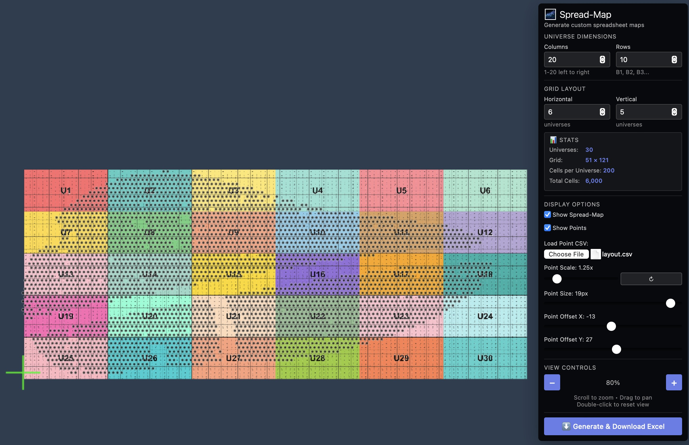
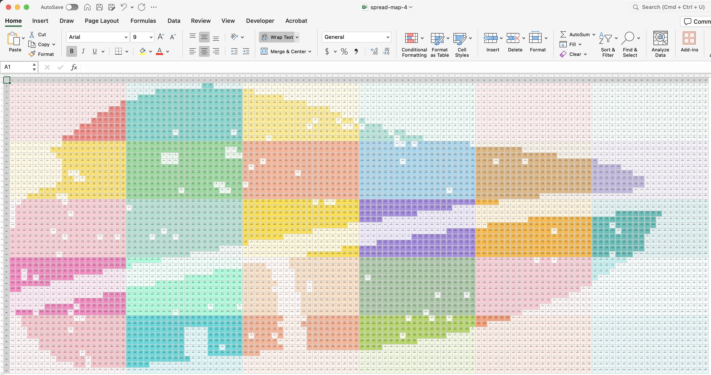

# Spread-Map Generator

> **Note:** This project was developed with AI assistance.

A client-side web application that generates Excel spreadsheets with multiple "universes" arranged in a grid pattern. Includes point cloud visualization and export capabilities.

## Screenshots

### Web Application

*Interactive canvas with zoom/pan controls, point cloud overlay, and live preview*

### Excel Export

*Generated spreadsheet with color-coded universes, point markers (●), and cell formatting*


## Features

### Visual Preview
- 🖼️ **Full-screen canvas preview** - automatically fits all universes with zoom controls (80%-2000%)
- 🔍 **Cell-by-cell rendering** - each cell displays column number, universe label (U#), and row designation (B#)
- 🎨 **Color-coded universes** - distinct colors with high contrast between neighbors
- 📍 **Point cloud overlay** - visualize CSV data points on top of the grid
- 🔎 **Zoom & Pan** - mouse wheel to zoom, click & drag to pan, double-click to reset
- 🎛️ **Compact floating control panel** - dark overlay panel in top-right corner

### Point Cloud Support
- 📊 **CSV import** - load point data from `layout.csv` (auto-loaded on startup)
- 🎯 **Auto-scaling** - detects pitch/spacing and scales to match grid cells
- 🔧 **Manual adjustments** - fine-tune scale and X/Y offset with sliders
- 📍 **Export markers** - cells containing points get a ● symbol in the Excel file
- ⚡ **Staggered rows** - alternates dot position (left/right) to show hexagonal patterns
- 🎨 **Visual differentiation** - cells with points have 80% opacity, empty cells 15%

### Excel Export
- ⬇️ **Direct download** - generates `spread-map.xlsx` in your browser
- 🎨 **Full styling** - colors, borders, alignment, and text formatting
- 📐 **Square cells** - fixed dimensions (50pt height × 7.5 char width)
- 💾 **Settings persistence** - remembers your configuration across sessions

## Cell Format

Each cell contains three lines:
```
8
U6-B10

```
- **Line 1**: Column number (1-20, left to right)
- **Line 2**: Universe number (U1-U36) and row designation (B1-B13)
- **Line 3**: Empty line for your own notes

Cells with CSV points add a ● marker on the first line:
```
● 8    or    8 ●
U6-B10        U6-B10

```

## Configuration

Default settings (adjustable in GUI):
- **Grid**: 6 horizontal × 5 vertical universes (30 total)
- **Each Universe**: 20 columns × 10 rows
- **Total Size**: 120 columns × 50 rows (plus headers)
- **Initial Zoom**: 80%
- **Point Size**: 20px

All settings are automatically saved to browser localStorage.

## Controls

### Grid Configuration
- **Columns/Rows**: Number of cells per universe (1-50)
- **Horizontal/Vertical Universes**: Grid layout (1-20)

### Point Cloud
- **Show Spread-Map**: Toggle grid visibility
- **Show Points**: Toggle point cloud visibility
- **Load Point CSV**: Upload custom CSV file (format: `ID,px,py,pz,Universe`)
- **Point Scale**: Adjust relative scale (0.01-10x, with reset button)
- **Point Size**: Visual dot size (1-20px)
- **Point Offset X/Y**: Fine-tune position (±500px)

### View Controls
- **Zoom buttons**: +/- for stepping, or use mouse wheel
- **Double-click**: Reset view to 100%
- **Drag**: Pan the view

## Using Generated Files

### Google Sheets
1. File → Import → Upload
2. Select `spread-map.xlsx`
3. Import location: "Replace spreadsheet"
4. Colors and formatting will be preserved

### Apple Numbers
1. Open `spread-map.xlsx` in Numbers
2. Colors and point markers import automatically
3. To lock images: Format → Arrange → Lock (prevents accidental selection)

### Microsoft Excel
1. Open `spread-map.xlsx` directly
2. All styling is preserved
3. Adjust zoom to view entire grid

## Technical Details

### Library Used
**xlsx-js-style** - SheetJS fork with styling support
- CDN: `https://cdn.jsdelivr.net/npm/xlsx-js-style@1.2.0/dist/xlsx.bundle.js`
- Supports: cell colors, borders, alignment, wrapping, fonts, row/column sizing

### Point Cloud Mapping
- Detects pitch/spacing from CSV data (X and Y axes)
- Auto-calculates ideal scale: `1 / pitch`
- Maps points to cells using same coordinate transform as visual preview
- Alternates dot position based on CSV row parity (even=left, odd=right)

### Color Transparency
- Universe cells: 20% transparency (80% opacity)
- Empty cells: 85% transparency (15% opacity)
- Cells with points: Full opacity for visibility
- Blending formula: `rgb * opacity + 255 * (1 - opacity)`

### Browser Compatibility
✅ Chrome, Safari, Firefox, Edge (modern versions)

### Performance
- Small grids (≤30 universes): Instant
- Medium grids (30-60 universes): 1-2 seconds
- Large grids (60+ universes): 3-5 seconds
- Pre-rendered canvas: Fast zoom/pan at any size

### Storage
- Settings saved to browser `localStorage`
- Survives page reload and browser restart
- Clear with: `localStorage.removeItem('spreadMapSettings')`

### Generated Files
- `spread-map.xlsx` - Excel output with all styling and point markers

## Tips

- **Start small**: Test with 3×2 universes to understand the system
- **Reset button**: Use ↻ next to Point Scale to restore auto-detected value
- **Zoom workflow**: Fit all → zoom to area → adjust points → export
- **Save often**: Settings persist automatically, but bookmark your configs
- **Point alignment**: Use offset sliders if CSV data doesn't perfectly align with cells

---

**No installation required** • **Runs entirely in browser** • **Privacy-friendly** (all processing local)
